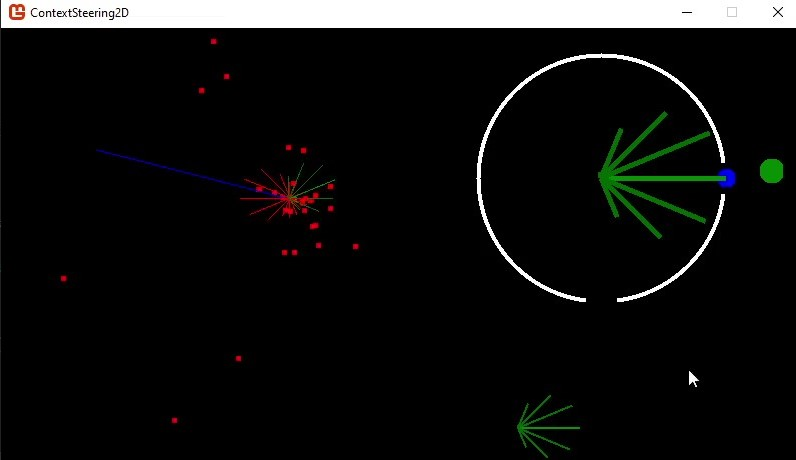
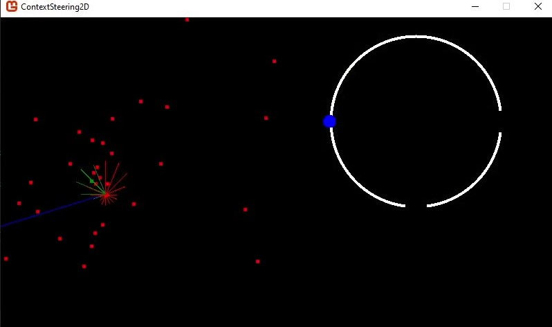
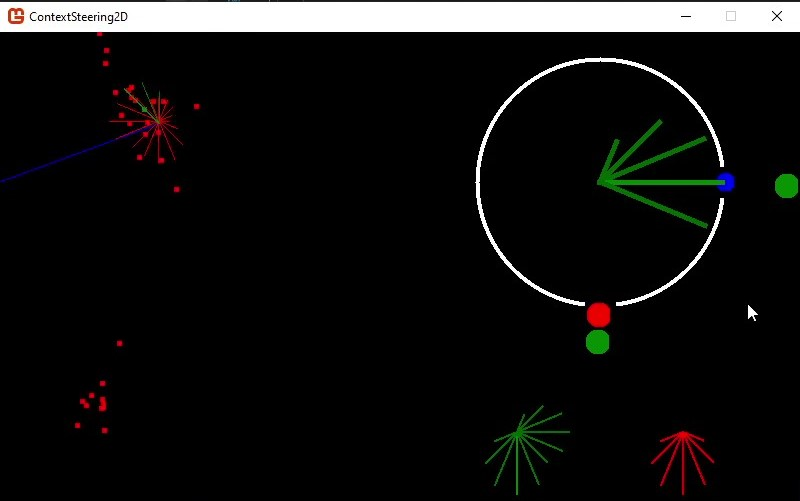

# ContextSteering2D

ContextSteering2D is a class to enable easy implementation of context-based steering behaviors.



This class calculates a most desired angle to travel in based on given context information in the form of attraction and repulsion vectors.

Much of the code was inspired from this article: 
http://www.gameaipro.com/GameAIPro2/GameAIPro2_Chapter18_Context_Steering_Behavior-Driven_Steering_at_the_Macro_Scale.pdf

# Getting Started

## Implementing in your project

The main file is called ContextSteering.cs and is located in the main directory.

Dependancies:
- System
- System.Collections.Generic
- Microsoft.Xna.Framework

## Using ContextSteering2D

### Constructor

The constructor takes an x and y position as floats
```cs
ContextSteering cts = new ContextSteering(x, y);
```

These describe the center of the context map.  All attraction and repulsion verticies will be compared to the context map relative to this point

It can be changed after construction
```cs
cts.x = 100f;
cts.y = 100f;
```

### Adding Context Vectors

There are generally two types of context vectors that can be taken into account.  Attraction and repulsion vectors.

They are both the same object, only with a boolean to change its attraction or repulsion status

```cs
//Constructs attraction vector
ContextVector acv = new ContextVector(x, y, true);

//Constructs repulsion vector
ContextVector rcv = new ContextVector(x, y, false);
```

They have different parameters that can be edited after construction

```cs
double cv.strength;
bool cv.isAttraction;
float cv.x;
float cv.y;
```

The strength parameter changes how much this vector is weighed compared to other vectors.  Increasing its strength increases its attraction/repulsion

isAttraction can be used to edit if this vector is an attraction or repulsion vector

These vectors once constructed can be added to the context steering class so they are accounted for in calculations
```cs
ContextVector cv = new ContextVector(x, y, true);
cts.AddVector(cv);
cts.DeleteVector(cv);
cts.ClearVectors();
```

You can also set the context vectors to be accounted for equal to a given list of context vectors
```cs
List<ContextVector> contextVectors = new List<ContextVector>();
cts.SetVectors(contextVectors);
```
This method stores the context method by reference, so changing the list externally also changes the vectors accounted for

### Update

The method UpdateMap() is used to update the context map in accordance to the context vectors given

```cs
cts.UpdateMap();
```

This method returns an array of doubles, but it is reccomended that this is ignored.

Getting the most desired angle should be done by calling the angle after the map is updated
```cs
cts.angle;
```

### Other Options

The context map contains some parameters that can be changed to your specifications.
```cs
int resolution; //Default value is 16
```
This parameter changes how many weight values are calculated when constructing the context map, thereby increasing most desired angle accuracy.

In most situations, 16 will serve fine.

### See Attraction And Repulsion Maps

The raw attraction and repulsion maps can be gotten as an array of doubles using these methods 
```cs
cts.GetAttractionMap(); //Returns double[]
cts.GetRepulsionMap();  //Returns double[]
```


# Example Build
 
## Boid Simulation


On the left is the boid simulation.  By default, there is a debug boid colored blue.  Its attraction and repulsion maps are drawn on its position at all times.

Boids have three main behaviors:
- Separation
  - Each boid is processed as a repulsion vector
  - Generates repulsion map
- Alignment
  - The average boid angle is gotten and a relative attraction vector is created to represent this angle
  - Represented by blue line
- Cohesion
  - The average boid position is gotten and an attraction vector with increased strength is used to represent this desire
  - Represented by green dot.  Generates attraction map

## Static Context Map



On the right is a display of the context map.  In the example build, this is interactive.

> Left click to create attraction vector
> Right click to create repulsion vector
> Press SPACE to create relative attraction vector
> Press R to clear all created vectors

What is displayed in the white circle is the fully generated and accounted for context map.

On the bottom right, the attraction map is displayed

On the bottom left, the repulsion map is displayed


